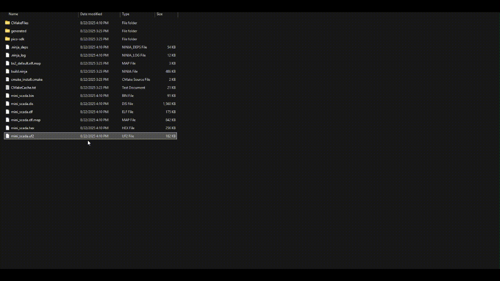

# 🖥️ Mini SCADA Console (Raspberry Pi Pico, C++)

This project implements a **USB-CDC command console** on the Raspberry Pi Pico that simulates a simplified **SCADA field device**.
It supports command/response interaction over a serial console and demonstrates industrial-style telemetry, logging, and device control using only the Pico board (no external sensors required).

---

## ✨ Features

* **USB-CDC console** (appears as a COM port on Windows, `/dev/ttyACM0` on Linux).
* Internal temperature sensor readout (ADC4).
* Built-in LED control (`on`, `off`, `toggle`).
* Status reporting (`status` command).
* Adjustable periodic logging (`log on/off`, `rate <ms>`).
* Simple SCADA-like interaction via text commands.

---

## 📸 Demo



---

## 📋 Example Console Session

```text
== Mini SCADA Console ==
Device: PICO-FIELD-01
Commands:
  help               - show this help
  id                 - print device id
  status             - one-shot status (temp, led, period)
  log on|off         - periodic status logging
  rate <ms>          - set status/log period in ms
  led on|off|toggle  - control onboard LED
  temp               - read temperature once

> id
PICO-FIELD-01
> status
id=PICO-FIELD-01 temp=28.75C led=OFF period=1000ms
> led on
OK
> temp
28.70
> rate 500
OK 500
> log on
OK log on
[STATUS] id=PICO-FIELD-01 temp=28.77C led=ON period=500ms
[STATUS] id=PICO-FIELD-01 temp=28.78C led=ON period=500ms
```

---

## 🧱 Hardware Requirements

* Raspberry Pi Pico (tested on Pico, should also run on Pico W).
* USB cable (data-capable).

No additional hardware or sensors are required.

---

## ⚙️ Build Instructions

### Prerequisites

* Raspberry Pi Pico SDK installed.
* Toolchain: `cmake`, `ninja`, `arm-none-eabi-gcc`.
  (On Windows, easiest path is the official **Pico Setup for Windows Installer**.)

### Clone & Build

```bash
git clone https://github.com/<your-username>/mini-scada-pico.git
cd mini-scada-pico
mkdir build && cd build
cmake -G "Ninja" -DPICO_BOARD=pico ..
ninja
```

The output UF2 file will be at:

```
build/mini_scada.uf2
```

---

## 🚀 Flash & Run

1. Hold **BOOTSEL** while plugging in the Pico.
2. Copy `mini_scada.uf2` onto the RPI-RP2 mass storage device.
3. The Pico will reboot and appear as a serial device:

   * Windows: `USB Serial Device (COMx)`
   * Linux: `/dev/ttyACM0`
4. Open a terminal (e.g., PuTTY, minicom) at **115200 baud**.
5. Type commands (`help`, `status`, `temp`, …) and interact.

---

## 📂 Project Structure

```
mini-scada-pico/
 ├─ main.cpp                # Application entry point
 ├─ utils.hpp / utils.cpp   # Command parser + helpers
 ├─ CMakeLists.txt
 ├─ pico_sdk_import.cmake
 ├─ assets/demo.gif         # Demo animation
 ├─ README.md
 └─ LICENSE
```

---

## 📖 Blog Post

For a more detailed **technical deep-dive** into how this project was built, check out the blog post:
👉 [Mini SCADA Console — Technical Breakdown](https://dev.to/<your-username>/mini-scada-console)

---

## 📜 License

MIT
